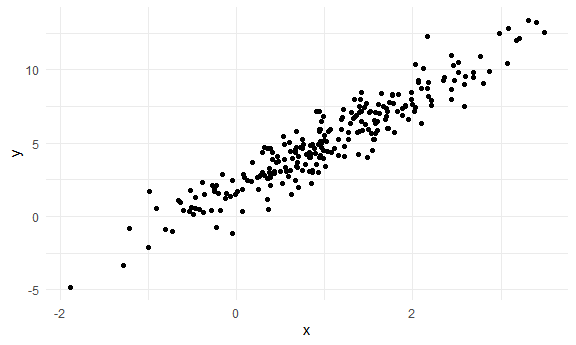
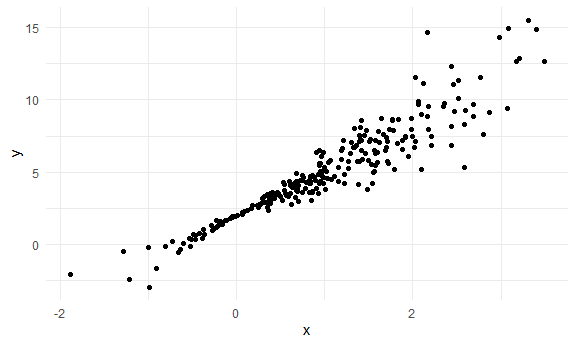

Bootstrapping
================

Load key packages.

``` r
library(tidyverse)
library(p8105.datasets)
library(modelr)

set.seed(1)
```

## Generate a relevant example

``` r
n_samp = 250

sim_df_const =
  tibble(
    x = rnorm(n_samp, 1, 1),
    error = rnorm(n_samp, 0, 1),
    y = 2 + 3 * x + error
  )

sim_df_nonconst =
  sim_df_const |> 
  mutate(
    error = error * .75 * x,
    y = 2 + 3 * x + error
  )

sim_df_const |> 
  ggplot(aes(x = x, y = y)) + geom_point()
```



``` r
sim_df_nonconst |> 
  ggplot(aes(x = x, y = y)) + geom_point()
```



fit some linear models

``` r
sim_df_const |> 
  lm(y ~ x, data = _) |> 
  broom::tidy()
```

    ## # A tibble: 2 × 5
    ##   term        estimate std.error statistic   p.value
    ##   <chr>          <dbl>     <dbl>     <dbl>     <dbl>
    ## 1 (Intercept)     1.98    0.0981      20.2 3.65e- 54
    ## 2 x               3.04    0.0699      43.5 3.84e-118

``` r
sim_df_nonconst |> 
  lm(y ~ x, data = _) |> 
  broom::tidy()
```

    ## # A tibble: 2 × 5
    ##   term        estimate std.error statistic   p.value
    ##   <chr>          <dbl>     <dbl>     <dbl>     <dbl>
    ## 1 (Intercept)     1.93    0.105       18.5 1.88e- 48
    ## 2 x               3.11    0.0747      41.7 5.76e-114
